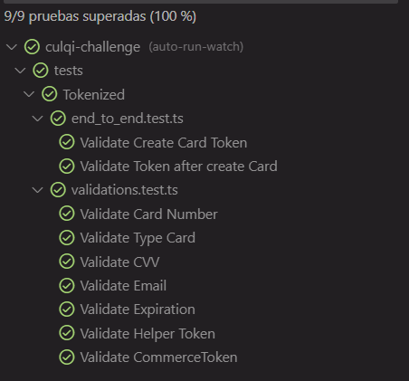

# Reto para Culqi

Este reto es un backend donde podemos Tokenizar una tarjeta de credito y consultar el Token generado con un patron especifico ademas de utilizar en el backend Node.js + TypeScript y para los Test Jest adicionalmente los datos seran administrados por MongoDB y para la cache Redis.

## Aspectos a evaluar 

- **Node.js + TypeScript** 
    - **Resumen:** Se implemento la configuración de Node con **Nodemon** para manejar el levantamiento del servidor y estar a la eschucha de los cambios, en Typescript se utilizo ES2022 y se manejó las Interfaces de la Card, CreationCard, Token para su uso en el tipado de funciones.
    
- **MongoDB + Redis** 
    - **Resumen:** Se realizo la conexión de mongoDB en la ruta **mongodb://localhost:27017/card_tokens** y se le agrego en el modelo de datos una expiración de **15 min** al registrar la tarjeta con el token generado no obstante para poder validar que el token ha expirado en tiempo mas NO en la existencia del mismo en MongoDB se incorporo **Redis** para la comparacion del token al consultarlo por GET ya que tiene una persistencia en Redis superior de **20 min** y comparandolos retornaria la expiracion del token ahorrando consultas GET hacia MongoDB y enfocadas en la cache hacia Redis.
 
- **Diseño y estructura del proyecto:** el punto se desarrolla [AQUI](#seccion-arquitectura) 
 
- **Modelado y Schema de datos:** el punto se desarrolla [AQUI](#seccion-datos) 
 
- **Implementación de la API:** el punto se desarrolla [AQUI](#seccion-apis) 
 
- **Validaciones:** Se utilizo un middleware para validar la estructura de datos enviada tanto en Post como en Get

- **Pruebas:** La implementación de pruebas se enfoco en las validaciones que son llamadas por los **Chains** por medio de los middlewares y se realizo dos pruebas para los Endpoints end to end para un total de 9 pruebas.

     

- **Tecnologías:** express, express-validator, typescript, jest, ioredis, mongoose, husky y commitlint

- **Extras:** Se agrego un estandar de smart commits y revision de test antes de enviar por git cualquier feature de la mano de husky que automatiza el proceso. 
 

## Rutas del reto

- **Header**

    - **Authorization**: pk_test_1234567891021234

- **GET:** http://localhost:5000/api/v1/card/:token  
- **POST:** http://localhost:5000/api/v1/card/tokenize 


## Levantar el proyecto en local ##
 
- **backend:**
  - pnpm run install 
  - pnpm start
  - url: http://localhost:5000/api/v1/card/
  
  

## Arquitectura del Sistema
<div id="seccion-arquitectura"></div>

El backend se compone de la implementación de lo mejor de 4 tipos de arquitectura:

- **Clean Architecture**
    - **Ventaja:** Proporciona una estructura modular y desacoplada, lo que facilita la comprensión y el mantenimiento del código. Permite la independencia de las capas, lo que facilita la realización de pruebas unitarias y la sustitución de componentes.
    
    - **Desventaja:** La implementación de Clean Architecture puede requerir un tiempo adicional en comparación con enfoques menos estructurados. La estricta separación de responsabilidades puede resultar en una mayor complejidad inicial y requerir un mayor esfuerzo de diseño.
    
     
    
- **Hexagonal Architecture**

    - **Ventaja:** Proporciona un alto nivel de modularidad y desacoplamiento al separar claramente las dependencias internas y externas de una aplicación. Esto facilita las pruebas unitarias, el reemplazo de componentes y la adaptación a cambios en los requisitos externos.
    
    - **Desventaja:** La implementación de Hexagonal Architecture puede ser compleja y requerir un enfoque cuidadoso en el diseño inicial. La adición de adaptadores y puertos puede aumentar la complejidad del código, especialmente en aplicaciones pequeñas o simples.
    
     
    
- **Vertical Slicing**

    - **Ventaja:** Permite desarrollar y entregar funcionalidades completas y listas para usar de forma más rápida y eficiente. Facilita la colaboración y la comunicación entre los miembros del equipo al enfocarse en una característica específica en lugar de en capas o componentes individuales.
    
    - **Desventaja:** La implementación de Vertical Slicing puede resultar en una mayor complejidad en comparación con enfoques más tradicionales, ya que implica la coordinación y el manejo de múltiples flujos de trabajo simultáneos. Requiere una planificación cuidadosa y una comunicación efectiva entre los miembros del equipo.
     
     
    
- **Screaming Architecture**

    - **Ventaja:** Promueve una arquitectura enfocada en los conceptos clave y los casos de uso principales de la aplicación. Proporciona una estructura clara y expresiva que facilita la comprensión del propósito y la funcionalidad de cada componente.
    
    - **Desventaja:** La implementación de Screaming Architecture puede requerir una mayor planificación y diseño inicial, ya que se basa en la identificación y la definición de conceptos y casos de uso clave. Puede ser menos flexible en comparación con enfoques más generales, lo que puede dificultar la adaptación a cambios o requisitos adicionales en el futuro.

     

## Estructura final

```
- src
    - global
    - modules
        - Tokenized
            - adapters
                - controllers
                - middlewares
                - routes
                - validations
                    - chains
            - application
                - adapters
                - usecases
            - domain
                - interfaces
                - models
                - repositories
                - schema
            - infrastructure
                - data
                    - redis
    - shared
        - config
        - helpers
        - middlewares 
 index.ts
 routes.ts 
- tests 
  - Tokenized
``` 
 
 
## Modelo de datos

<div id="seccion-datos"></div>

**ICard**
```
* token: string;
* commerceToken: string;
* cardNumber: string;
* cvv: string;
* expirationMonth: string;
* expirationYear: string;
* email: string;
* createdAt: Date;
```
**ICreateCard**
``` 
* cardNumber: string;
* cvv: string;
* expirationMonth: string;
* expirationYear: string;
* email: string; 
```

**IToken**
``` 
* token: string; 
```

## Schema de datos

**cardSchema**
``` 
* token: { type: String, required: true },
* commerceToken: { type: String, required: true },
* cardNumber: { type: String, required: true },
* cvv: { type: String, required: true },
* expirationMonth: { type: String, required: true },
* expirationYear: { type: String, required: true },
* email: { type: String, required: true },
* createdAt: { type: Date, default: Date.now, expires: '15m' } 
```


## Endpoints

<div id="seccion-apis"></div> - Lista de endpoints

```
tokenizedRouter.get('/:token', getTokenizedMiddleware, getTokenizedController);
tokenizedRouter.post('/tokenize', postTokenizedMiddleware, postTokenizedController);
```

## Decisiones Tomadas

Al inicio del proyecto se considero utilizar solo una arquitectura con alguna buena practica de clean arquitecture no obstante considere llevarlo a un entorno donde desacoplar y poder escalar modulos a futuro me parecio mas adecuado ya que mi intencion es que el proyecto pueda utilizarse sin la atadura estructural de la arquitectura hexagonal no obstante se agrego un pequeño versionamiento a los enpoints v1 ya que en mi experiencia puede ser muy util cuando queremos darle una comparacion de rendimiento o algun cambio fuerte a un endpoint. 

Adicionalmente se ha agregado una carpeta shared donde podrian incluir otros modelos de BD como por ejemplo Mysql, PostgreSql, DynamoDB u algun otro gestor de datos.